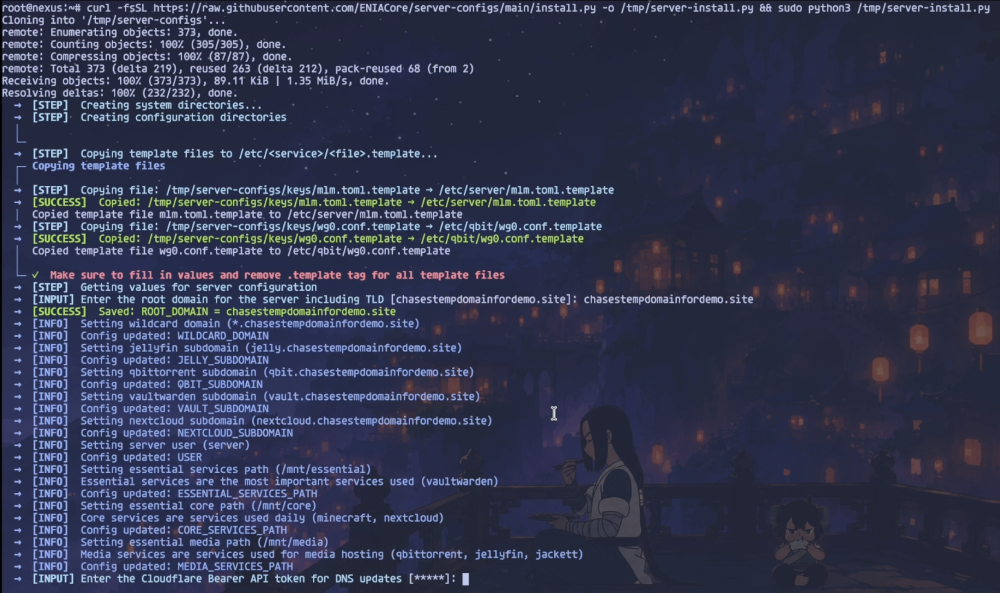
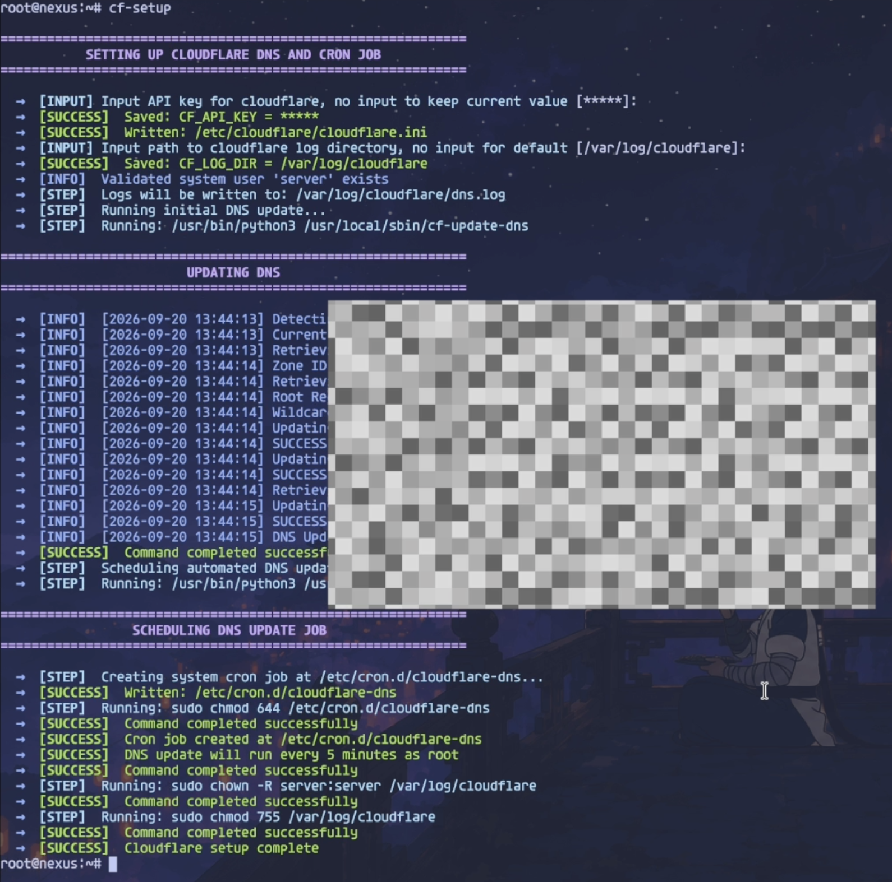
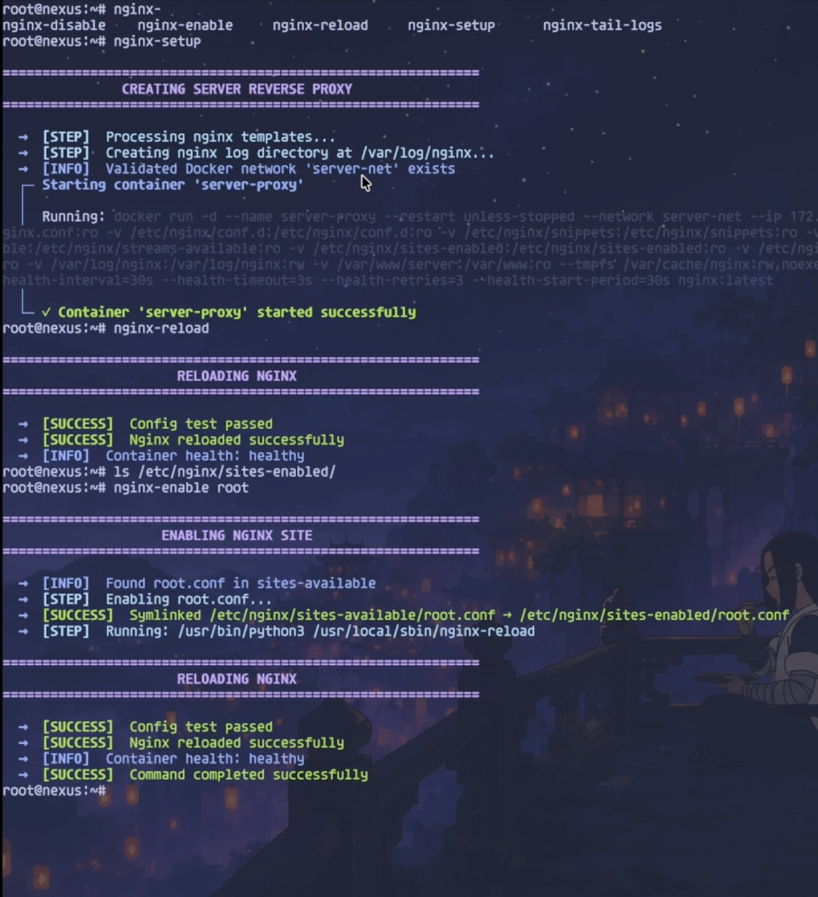

<a id="readme-top"></a>

[![Contributors][contributors-shield]][contributors-url]
[![Forks][forks-shield]][forks-url]
[![Stargazers][stars-shield]][stars-url]
[![Issues][issues-shield]][issues-url]
[![MIT License][license-shield]][license-url]
[![Latest Release][release-shield]][release-url]

<br />
<div align="center">
  <h3 align="center">Server-AIO</h3>

  <p align="center">
    All-in-one, self-hosted server setup with security hardening and reverse proxy configuration
    <br />
    <a href="https://github.com/ENIACore/server-configs"><strong>Explore the docs</strong></a>
    <br />
    <br />
    <a href="https://github.com/ENIACore/server-configs/issues/new">Report Bug</a>
    &middot;
    <a href="https://github.com/ENIACore/server-configs/issues/new">Request Feature</a>
  </p>
</div>

<details>
  <summary>Table of Contents</summary>
  <ol>
    <li>
      <a href="#about-the-project">About The Project</a>
      <ul>
        <li><a href="#built-with">Built With</a></li>
      </ul>
    </li>
    <li>
      <a href="#getting-started">Getting Started</a>
      <ul>
        <li><a href="#prerequisites">Prerequisites</a></li>
        <li><a href="#installation">Installation</a></li>
      </ul>
    </li>
    <li><a href="#what-gets-installed">What Gets Installed</a></li>
    <li><a href="#demo">Demo</a></li>
    <li><a href="#screenshots">Screenshots</a></li>
    <li><a href="#releases">Releases</a></li>
    <li><a href="#roadmap">Roadmap</a></li>
    <li><a href="#contributing">Contributing</a></li>
    <li><a href="#license">License</a></li>
    <li><a href="#contact">Contact</a></li>
  </ol>
</details>

## About The Project

Server-AIO is an all-in-one setup toolkit that turns a fresh Ubuntu Server into a repeatable self-hosted platform — in the same spirit as [nextcloud-aio](https://github.com/nextcloud/all-in-one), but for the whole server rather than a single app. One installer bootstraps the shared infrastructure (Cloudflare DNS updates, a Docker-based Nginx reverse proxy, UFW, Fail2ban, and a shared Docker network), then separate setup commands bring up individual services such as Nextcloud, Vaultwarden, and Jellyfin on top of it.

Unlike a black-box AIO container, every piece here stays a plain, inspectable script and config file — nothing is hidden behind a control panel. Review and adapt the scripts for your network before exposing services to the internet.

<p align="right">(<a href="#readme-top">back to top</a>)</p>

### Built With

- [![Python][Python-badge]][Python-url]
- [![Bash][Bash-badge]][Bash-url]
- [![Docker][Docker-badge]][Docker-url]
- [![Nginx][Nginx-badge]][Nginx-url]

<p align="right">(<a href="#readme-top">back to top</a>)</p>

## Getting Started

### Prerequisites

Before running the installation script, ensure you have:

- Ubuntu Server LTS
- Root or sudo access
- Active internet connection
- A domain and Cloudflare API token for the included DNS automation
- Docker for the service setup scripts

### Installation

Run this command in your Ubuntu terminal to start the installation:

```bash
curl -fsSL https://raw.githubusercontent.com/ENIACore/server-configs/main/install.py -o /tmp/server-install.py && sudo python3 /tmp/server-install.py
```

The installer copies the available commands to `/usr/local/sbin`, collects the
initial server configuration, and prepares Nginx templates for the configured
domain. Run the infrastructure and service setup commands you want afterward.

<p align="right">(<a href="#readme-top">back to top</a>)</p>

## What Gets Installed

Server-AIO provides setup commands for the following services and infrastructure:

**Services:**

- **Nextcloud** - Self-hosted file sync and share platform
- **Vaultwarden** - Lightweight Bitwarden server implementation
- **Jellyfin** - Media server for your personal media collection
- **qBittorrent** - Torrent client with built-in WireGuard VPN (via the hotio image)
- **Jackett** - Indexer proxy for torrent trackers
- **jfa-go** - Jellyfin account management
- **Minecraft** - Fabric server with Lithium
- **PostgreSQL** and a personal-site container

**Security & Infrastructure:**

- **Nginx** - Reverse proxy with SSL termination
- **Cloudflare DNS** - Dynamic DNS updates for root and wildcard records
- **Fail2ban** - Intrusion prevention system
- **UFW Firewall** - Uncomplicated firewall configuration
- **Docker networking** - Shared internal network for service-to-service communication

Useful operational commands include `nginx-enable`, `nginx-disable`,
`scan-ports`, `docker-network-inspect`, `docker-system-prune`,
`add-healthcheck-cron`, `mask-sleep`, and `unmask-sleep`.

<p align="right">(<a href="#readme-top">back to top</a>)</p>

## Demo

[](https://youtu.be/xd_rBWV8tak)

<p align="right">(<a href="#readme-top">back to top</a>)</p>

## Screenshots

### Initial installation



### Cloudflare DNS setup



### Reverse proxy setup



<p align="right">(<a href="#readme-top">back to top</a>)</p>

## Releases

Tagged releases (`vMAJOR.MINOR.PATCH`) are cut from `main` and listed on the
[Releases page][release-url]. See [CHANGELOG.md](CHANGELOG.md) for a
per-version summary of what changed. Between releases, `main` tracks the
maintainer's live server configuration directly.

<p align="right">(<a href="#readme-top">back to top</a>)</p>

## Roadmap

- [ ] Add support for additional Linux distributions
- [ ] Implement automated backup solutions
- [ ] Add monitoring and alerting system
- [ ] Create web-based configuration interface
- [ ] Add support for additional self-hosted services

See the [open issues](https://github.com/ENIACore/server-configs/issues) for a full list of proposed features and known issues.

<p align="right">(<a href="#readme-top">back to top</a>)</p>
